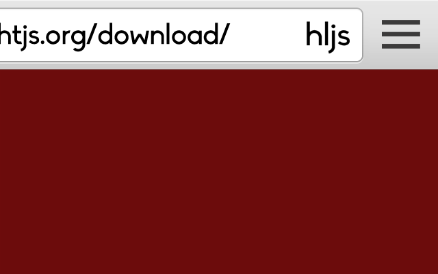

= Highlightjs Auto Checker
Hakan Özler
:webstore: https://chrome.google.com/webstore/detail/highlightjs-auto-checker/dlfmldhfdefdlfjojpkmeipefdablifb

image::https://developer.chrome.com/webstore/images/ChromeWebStore_Badge_v2_206x58.png[link="{webstore}"]

== Usage

1. Install extension from {webstore}[Chrome Web Store]
2. Go to https://highlightjs.org/download/
3. You will see the extension icon in the address bar of the current tab.
4. Click to check all the implemented languages containing in the 'other' section to include them for a custom bundled. You can uncheck them as well.
5. Voila!

== Copyright

Copyright (C) 2015 Hakan Özler. 
Free use of this software is granted under the terms of the MIT License.